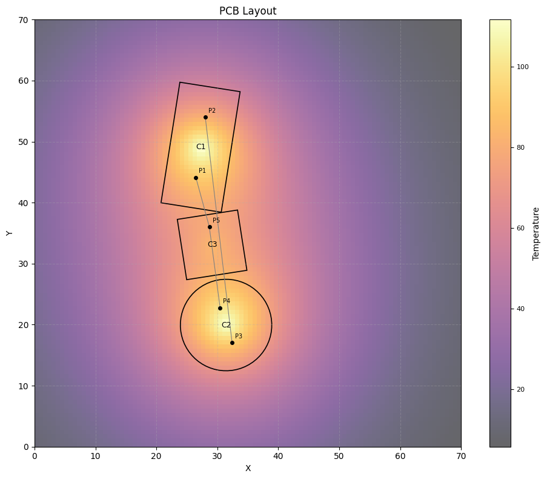
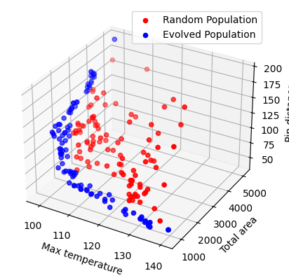

# PCB Layout Optimization via Multi-Objective GA

In this project, the main task is to optimize the position of components of different shape, dimension and with different pins layout in a rectangular pcb board of given dimension. The objective functions taken into account are
- Maximum temperature reached in the board
- Total distance between pins that needs to be connected
- Total area occupied by components

---

## File structure
PCB_Layout_Optimization/
├── Component_class.py           # Definition of the Component class and the Pin class
├── PCB_class.py                 # Definition of the PCB class (individual)
├── Genetic_algorithms.py        # Functions used for the GA (random population, crossover, different mutations...)
├── NSGA_II_implementation.py    # Functions used for the Multi-objective optimization (NSGAII)
├── Plots.py                     # Plot functions
├── utils.py                     # Utility functions
├── main.py                      # Same as Example_of_use but in a .py file
├── Example_of_use.ipynb         # Example of an entire pipeline as notebook with intermediate plots and results
├── PCB - layout optimization.pdf # Project presentation slides
└── images/                      # Images and results

---

